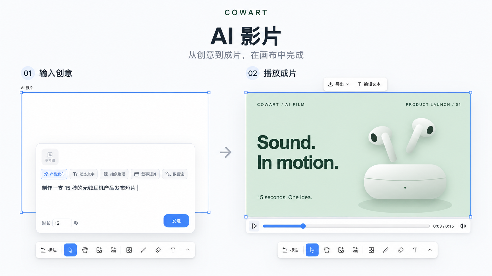

# Cowart

Cowart is a native infinite-canvas widget plugin for Codex. It brings a tldraw-powered canvas into Codex for visual thinking, annotation, image generation, and annotation-driven image edits. The canvas opens directly as an MCP widget, and its data is saved in the active user project under `canvas/` instead of inside the plugin repository.

The repository also conforms to [Agent Plugins v1.0.0](https://agent-plugins.org/specification): root-level `plugin.json`, `skills/`, and `mcp.json` provide the portable plugin entry points, while `.codex-plugin/plugin.json`, `.mcp.json`, and `.agents/plugins/marketplace.json` retain Codex-specific interface and installation metadata.

中文说明: [README.md](README.md)

## Try Cowart on the Web

**No installation required—start creating right away.**

Open [**cowart.jiqiren.ai**](https://cowart.jiqiren.ai/) in the Codex built-in browser, sign in to enter the canvas, and start creating.

## Features

- Open Cowart from global navigation and use the host's pin control to keep it in the sidebar. The sidebar opens a single canvas in the system Documents/Cowart folder directly, with no folder picker.
- Open a native tldraw infinite-canvas widget from Codex; normal use no longer opens a local page through a web browser or the in-app browser.
- Persist canvas pages and image assets in the active project directory.
- Create AI image slots on the canvas, enter a prompt directly, choose reference images, and let Codex generate an image that replaces the selected slot at the same position and aspect ratio.
- Create a 16:9 `AI HTML` slot, generate a runnable single-file HTML page from a prompt and reference images, and embed it directly on the canvas for further editing and iteration.
- Create `AI 影片` to turn a prompt and reference images into an HTML/JS motion film with timed shots, music, and sound effects; preview it on the canvas, edit its text, and export MP4.
- Create `AI Slides` to organize images and HTML into a deck, or ask Codex to generate a specified number of coordinated 16:9 HTML pages; preview the deck with thumbnails or play it fullscreen.
- After annotating an image, submit the annotation screenshot directly from the canvas so Codex can generate a clean revised image beside the original.
- Use Cowart MCP tools to read selection state, save the canvas, insert images or HTML, and save page-local assets.

The [OpenAI MCP Extensions global entrypoint](https://github.com/openai/mcp-extensions/blob/main/docs/spec.md#global-entrypoint) receives empty arguments and opens `<system Documents>/Cowart/canvas/`. It reuses all existing pages and creates the first page only when none exists. macOS uses `~/Documents`; Windows resolves the system Documents folder, including redirection/OneDrive. Chat calls with `projectDir` still open that project's canvas directly and do not depend on Documents. Global canvas context and each widget follow-up carry the actual storage paths. Tests isolate Documents with `COWART_DOCUMENTS_DIR`. The resource declares fullscreen as its only supported and preferred mode. Pinning and final placement are controlled by the host; inside a conversation, fullscreen can be a content side panel. These capabilities are available from `0.1.30`. Completely quit and restart Codex after installation or updates to load the new navigation entrypoint.

## Installation

> [!IMPORTANT]
> After installation, completely quit and restart Codex once before using Cowart. Restarting ensures that Cowart's new skills and MCP tools are fully loaded.

### Ask Codex To Install It

Send the following message to Codex:

```text
Please install the Cowart Codex plugin through the Git marketplace bundled with its repository.
First run codex plugin marketplace add zhongerxin/Cowart --ref main,
then run codex plugin add cowart@cowart-github and use codex plugin list to confirm it is enabled.
Cowart ships a self-contained MCP server and a prebuilt widget; it never runs npm install in the plugin cache and does not require new users to preinstall tldraw;
do not install dependencies manually in the current repository, plugin cache, or marketplace snapshot.
Do not clone the repository into the personal marketplace. When installation finishes, clearly remind me
to completely quit and restart Codex once before using Cowart.
```

### Manual Install

First register the Cowart Git repository as a Codex marketplace:

```bash
codex plugin marketplace add zhongerxin/Cowart --ref main
```

Then install Cowart from that marketplace and verify it:

```bash
codex plugin add cowart@cowart-github
codex plugin list
```

You do not need to locate the plugin cache manually. Cowart's Git release tracks a self-contained MCP bundle and a prebuilt single-file widget. Codex can discover `render_cowart_canvas_widget` without running `npm install` or relying on `node_modules`, tldraw, npm, or network access inside the plugin cache. Development dependencies are used only by Cowart maintainers to regenerate release artifacts before publishing.

If `cowart-github` is already registered, skip the first `marketplace add` command. After installation, completely quit and restart Codex once so the new skills, MCP tools, and release artifacts are fully loaded.

Codex automatically checks this Git marketplace when its plugin system starts and refreshes the installed Cowart plugin when the remote `main` branch changes. To check for an update immediately, run:

```bash
codex plugin marketplace upgrade cowart-github
```

An update may replace the plugin cache. After updating, completely quit and restart Codex; Cowart loads the MCP and widget artifacts shipped with the release and does not install dependencies into the new cache.

## Usage

### Open The Canvas

Ask Codex:

```text
Open the Cowart canvas for this project.
```

Cowart opens a native Codex widget through `render_cowart_canvas_widget`; it no longer needs a localhost page or manual in-app-browser navigation. `scripts/start-canvas.sh` remains only as a local-development fallback.

Canvas data is saved in the active project:

```text
canvas/pages/<page-id>/cowart-canvas.json
canvas/pages/<page-id>/assets/
```


### Generate A New Image

1. Open the Cowart canvas.
2. Create and select an `AI 图片` slot on the canvas.
3. In the generation panel, enter a prompt, optionally choose one or more reference images, then send the request.

Cowart sends the prompt, reference images, and selected `AI 图片` slot dimensions to Codex. Codex generates an image for that position and aspect ratio, then replaces the `AI 图片` slot with a normal image shape.


### Generate AI HTML

1. Create and select an `AI HTML` slot from the toolbar. New slots default to `1024 × 576` (16:9).
2. Enter a prompt in the generation panel below the slot. You can also choose or paste one or more reference images.
3. Send the request. Codex generates a complete runnable single-file HTML page and embeds it into the selected `AI HTML` slot.

The generated HTML is stored as an embedded canvas page in the current page's `assets/` directory. Select it to download a rendered image, edit text directly, continue revising the HTML with canvas annotations, or generate an image from the HTML and its annotations.


### Generate AI Films

Bring product launches, kinetic typography, abstract physics, editorial stories, or data flows onto the canvas. Choose a style and duration, enter a prompt and optionally add reference images, and Codex creates a playable motion film. Preview it in place, edit its text, and export an MP4 with music and sound effects.



*AI-generated illustration based on the current Cowart interface and actual workflow.*

1. Create an `AI 影片` slot. Its default is `1024 × 576` (16:9); reuse the right-side AI slot controls for size, ratio and aspect locking.
2. Choose product launch, kinetic type, abstract physics, editorial story or data flow above the prompt. Set duration at the bottom left (15 seconds by default, 1–120 seconds). Films start unmuted, and optionally upload or paste reference images.
3. Sending asks Codex to read `cowart-film-gen` and the selected style reference, then generate a standalone HTML/JS motion film with a storyboard, motion, background sound and event audio into the slot.
4. Select the film to play/pause, seek, mute, edit DOM text and export HTML. Text editing pauses playback. “导出为影片” renders a 30 FPS MP4 with music and sound effects (maximum long edge 1920 px), displays progress, and saves to Downloads. Preview mute does not affect the exported soundtrack. Export requires host support for H.264/AAC WebCodecs encoding and reports unsupported codecs. Annotation editing and annotation image generation are not included.

See the [film skill](skills/cowart-film-gen/SKILL.md) and [runtime contract](skills/cowart-film-gen/references/runtime-contract.md). Generated and exported self-contained HTML contains only film content and its playback API. The AI film container on the infinite canvas provides play/pause, progress, and mute controls. Export and preview scrubbing share a 30 FPS time grid. Export awaits asynchronous initialization, seek completion and font/image readiness, including CSS backgrounds. Embedded video is decoded at the requested timestamp via WebCodecs and fitted into its original geometry. Pending work supports cancellation and deadlines; failed assets and duration mismatches are reported.

Production now starts with a compact visual system and timed shots specifying actions, consequences, and handoffs, followed by a reusable subject/rig and the hardest transition. Actual keyframes, event-adjacent frames, and contact sheets where available guide visual repairs. The workflow is written for Codex/GPT and scales to the requested duration and speed. See [directing](skills/cowart-film-gen/references/directing.md), [visual review](skills/cowart-film-gen/references/visual-review.md), and [source inspection/adaptation](skills/cowart-film-gen/references/sources.md).

### Create And Present AI Slides

1. Create `AI Slides` from the toolbar. The default frame is `1048 × 600`, providing room for one `1024 × 576` (16:9) page with `12px` padding on every side.
2. Drag images or HTML from the canvas into the Slides frame. You can also copy an image, select the Slides frame, and paste it; items are arranged horizontally in order.
3. Selecting an empty Slides frame opens its generation panel. Describe the deck, optionally add reference images, and choose 3, 5, 10, or a custom number of pages. The default is 5 pages.
4. After you send the request, Codex generates the requested number of visually and narratively coordinated standalone 16:9 HTML pages and appends them to the current Slides frame. The generation panel is hidden once the frame contains content.
5. Select the Slides frame and click `演示 Slides` to preview and navigate with the thumbnail sidebar or enter fullscreen playback. In fullscreen, use the arrow keys, Space, or click static slide content to advance. Buttons, links, and form controls inside HTML remain interactive, and the playback controls stay at the top.


### Generate From An Annotation Screenshot

1. Annotate an image on the Cowart canvas.
2. Select the annotated image and click `按标注修改`.
3. Cowart exports a screenshot containing the original image, arrows, and annotation text, then sends it to Codex through the widget bridge.

Codex reads the notes and arrows in the screenshot, generates a clean revised image without annotation artifacts, and places it beside the original. The original image and annotations are not deleted or moved. You can also manually send a Cowart annotation screenshot to Codex and use the same revision workflow.


## Skills

- `cowart:cowart-open-canvas`: open the native Cowart canvas widget.
- `cowart:cowart-image-gen`: receive the canvas prompt and reference images, replace the selected `AI 图片` slot with a generated image, or insert a generated image into the current page when no slot is selected.
- `cowart:cowart-film-gen`: generate playable HTML/JS motion films using the selected style, prompt, dimensions and reference images.
- `cowart:cowart-image-edit`: generate a revised image from a Cowart annotation screenshot submitted from the canvas or provided by the user.

## Local Development

```bash
npm install
npm run dev
npm run build
```

`npm run build` regenerates and validates the self-contained MCP and widget release artifacts under `mcp/generated/`; those files must be committed with the Git release. Before committing source changes, also run `npm run quality`, which includes a cold-start probe with no `node_modules`, a fresh temporary directory, and an npm sentinel that fails if runtime installation is attempted.

`npm run probe:widget:startup` checks the startup scripts in the actual MCP resource and tests host information arriving before the project path, timeouts, cancellation, and bridge failures in an isolated environment. It is included in `npm run quality`. These tests do not replace native Codex UI verification on Windows / macOS.

HTML image, annotation, and slide exports share `src/htmlDraftCapture.js`. Its `src/html2canvasClipFix.js` adapter corrects ancestor clipping being applied before transforms in html2canvas 1.4.1, which could capture only one quarter of a centered, scaled HTML draft. This dependency is pinned; `npm run probe:html:capture` guards the adapter in the quality checks. For browser pixel, scaling, and nested clipping checks, run `npm run probe:html:capture:browser` and open its printed URL. This is a capture-function regression, not native plugin verification.

To diagnose native canvas startup, search the Codex client logs for `[Cowart startup]`. Since 0.1.29, these entries include the version, stage, and elapsed time: `html_loaded`, `bridge_connecting` / `bridge_ready`, `frontend_started`, `tool_result_received`, `storage_target_ready`, `canvas_state_loaded`, and `canvas_mounted`. Ordering can vary with host timing; failures record a corresponding `*_failed`, `*_timeout`, or script error stage. Successful milestones use warning level because Codex 26.928 only captures sandbox warnings and errors; those milestones are not failures. Each stage is logged once, logging stops after the canvas mounts, and paths, canvas content, and raw error messages are excluded.

For local development, you can still start the Vite canvas service directly and pass the active user project directory:

```bash
./scripts/start-canvas.sh /path/to/user/project
```

Useful environment variables:

- `COWART_PORT`: local service port, default `43217`.
- `COWART_PROJECT_DIR`: the user project directory that owns the canvas data.
- `COWART_CANVAS_DIR`: canvas data directory, default `$COWART_PROJECT_DIR/canvas`.

## Developer

ZHONG XIN  
zhongxin123456@gmail.com  
https://www.jiqiren.ai

## Acknowledgments

Cowart's canvas experience is built on top of [tldraw/tldraw](https://github.com/tldraw/tldraw).

## Sponsors

[Token Arena](https://token.jiqiren.ai/) is a game arena for agents: you pick a game and start a match, your agent takes the seat, and you can watch every decision it makes. Free practice matches are open now.

[](https://github.com/zhongerxin/Cowart/blob/main/assets/token-arena.mp4)
